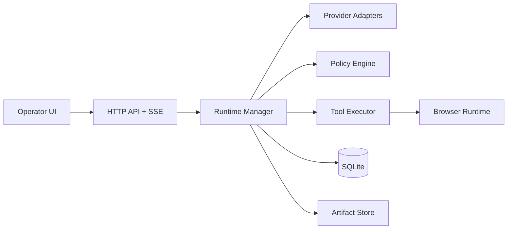

# Colosseum

**A self-hosted runtime and operator control plane for tool-using AI agents.**

It is built for teams that want:

- deterministic, inspectable execution
- operator controls (approve, interrupt, resume, steer)
- durable telemetry (events, spans, tool calls, artifacts)
- practical local deployment (single binary + SQLite)

---

## Why Colosseum

Most "agent chat" products optimize for conversational fluency. Colosseum optimizes for **operational correctness**:

- **Grounded execution**: agents use explicit toolchains, not implicit magic.
- **Traceability by default**: every meaningful action is persisted.
- **Safety gates**: policy/approval workflows for high-risk operations.
- **Recoverability**: runs can be resumed, replayed, exported, and audited.

---

## Quick Demo

**What a real run looks like:**

1. Create an agent profile (`model + system prompt + allowed tools`).
2. Start a chat session and send a task.
3. Watch live run events/steps/artifacts stream in.
4. Approve/interrupt/resume when policy gates trigger.
5. Inspect timeline, tool calls, and artifact outputs in Run Detail.

**What is unique:** Colosseum keeps the full execution graph, not just the final answer.

---

## What You Get

- **Agent profiles** (provider, model, prompt, allowed tools)
- **Run orchestration** with step-level replay and steering
- **Chat sessions** backed by run-linked persistence
- **Tool ecosystem** (shell/files/web/json/browser/artifact/test + custom tools)
- **Dispatcher pipeline** for polished user-facing responses
- **Output contracts** (semantic + deterministic validation)
- **Multimodal attachment input** for image-aware follow-up turns
- **Embedded React UI** for operators, approvals, debugging, and exports

---

## Architecture At A Glance



Core principle: **LLM for synthesis, deterministic code for guarantees**.

---

## Quick Start

### 1) Build

```bash
cd colosseum
make build
```

### 2) Run

```bash
OPENAI_API_KEY=... \
ANTHROPIC_API_KEY=... \
./bin/colosseum server --port 8001
```

Open `http://127.0.0.1:8001`.

Tip: for local developer ergonomics, you can keep API keys in `.env.local`.

---

## Core Concepts

- **Agent**: reusable execution configuration.
- **Run**: one execution instance for an agent + task.
- **Step**: single model iteration in a run.
- **Tool call**: one concrete invocation inside a step.
- **Event / span**: ordered telemetry timeline.
- **Artifact**: persisted output (screenshots, files, logs, patches, uploads).
- **Chat session**: user-facing thread over linked runs.

---

## Production-Grade Guarantees

### Response Pipeline + Contracts

Colosseum uses a two-stage response model:

1. **Dispatcher synthesis**: rewrites raw output when needed (noise/metadata cleanup).
2. **Deterministic contracts**: enforce attachment/link validity and output contract checks before completion.

This avoids "looks good, but wrong" responses.

### Attachment + Multimodal Input

- Uploaded files are persisted as run artifacts.
- Attachment events are promoted into runtime user context.
- Media handling uses provider/model capability policy and MIME transformers.
- Latest attachment context supersedes stale prior attachment context unless user asks for comparison.

### Approval + Status Safety

- Run status transitions are guarded (invalid transitions rejected).
- Approval events are only emitted when a pending approval is actually resolved.

---

## Repository Layout

```text
colosseum/
  cmd/colosseum                # binary entrypoint
  internal/
    api/                       # HTTP routes + SSE + embedded UI host
    config/                    # env/flag config
    db/                        # schema + migrations
    docker/                    # container lifecycle helpers
    policy/                    # tool policy / approval decisions
    providers/                 # OpenAI/Anthropic adapters
    runtime/                   # orchestration loop + contracts + dispatch
    secrets/                   # encryption/decryption helpers
    tools/                     # built-in/custom tools + browser runtime
  ui/                          # React + TypeScript operator interface
  docs/                        # full product and developer docs
```

---

## Documentation

Start here: [docs/README.md](docs/README.md)

Recommended path:

1. [Quickstart](docs/01-quickstart.md)
2. [Architecture](docs/02-architecture.md)
3. [Operator UI Guide](docs/05-operator-ui-guide.md)
4. [Security and Reliability](docs/07-security-reliability.md)
5. [Troubleshooting](docs/08-troubleshooting.md)
6. [Response Pipeline and Contracts](docs/12-response-and-media-pipeline.md)

---

## Development

### Backend

```bash
go test ./...
```

### Frontend

```bash
cd ui
npm run lint
npm run build
```

### Full Build

```bash
make build
```

---

## Scope and Non-Goals

Colosseum is optimized for **single-node, operator-led control-plane execution**.

It is not currently:

- a distributed job scheduler
- a multi-region control plane
- a hosted SaaS with managed tenancy

---

## Contributing

See [docs/09-development-contributing.md](docs/09-development-contributing.md).

---

## License

This project is licensed under the [MIT License](LICENSE).

---

## Public Launch Notes

Before publishing this repository publicly, double-check:

- no secrets/API keys in git history
- no private internal hostnames in docs/examples
- provider/API usage costs and limits are documented
- screenshots/demo assets reflect current UI
