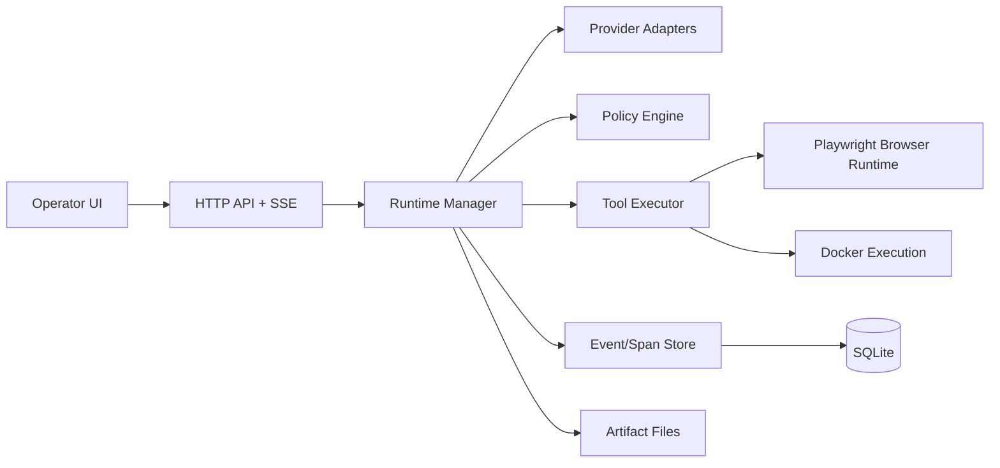

# Architecture

`colosseum` is a single-node control plane with durable state and explicit execution boundaries between model orchestration, tools, policies, and operator controls.

## System Overview

## Major Components

### API Layer (`internal/api`)

- CRUD + operational routes for agents, runs, tools, and ecosystem resources
- SSE stream for live run updates (`/api/stream/runs/{id}`)
- telemetry endpoints used by transcript/debug/event views
- prompt enhancement endpoints
- embedded static UI delivery

### Runtime Manager (`internal/runtime`)

- polls queued runs and claims one for execution
- executes model steps and tool calls with policy checks
- persists run steps, tool calls, spans, events, and terminal status
- supports interruption/approval/resume and steer-message continuation
- re-queues in-flight runs after restart (`running` -> `queued`)

### Persistence (`internal/db`)

SQLite is the source of truth for control-plane state:

- execution: `runs`, `run_steps`, `tool_calls`, `events`, `trace_spans`
- governance: `approvals`, `policies`, `tool_defs`, `provider_configs`
- ecosystem: `secrets`, `environments`, `credential_vaults`, `policies`
- outputs: `artifacts`, `containers`

Artifacts are written to disk and indexed in DB.

### Tool Layer (`internal/tools`)

- built-in tools (shell/file/path/patch/web/json/browser/artifact/test)
- custom tool execution from `tool_defs`
- workspace confinement, bounded outputs, and typed inputs

Browser tools run through a dedicated browser runtime:

- default backend: Docker Playwright image
- optional fallback: local Node/Playwright
- single-tab session lifecycle per run

### Provider Adapters (`internal/providers`)

- OpenAI and Anthropic adapters
- normalized completion response shape (`text`, `tool_calls`, `usage`)
- retry handling at runtime layer

### Policy Engine (`internal/policy`)

- allowlist enforcement (`allowed_tools`)
- risk pattern checks
- deny/allow/approval decisions per tool call

## Execution Lifecycle

1. Run is created (`queued`).
2. Runtime claims and marks run `running`.
3. Runtime builds effective system prompt (includes operational tool policy additions when tools are allowed).
4. Model step executes:
   - response text
   - optional tool calls
5. Tool calls are evaluated by policy and executed if allowed.
6. All telemetry and artifacts are persisted.
7. Run reaches terminal state (`completed`, `failed`, `cancelled`) or gated state (`interrupted`).
8. Operator steer event appends a user message and can re-queue terminal/interrupted runs for continuation.

## Reliability Model

- WAL mode SQLite + tuned connection pool
- persistent timeline enables replay/debug/exports
- startup recovery for interrupted runtime process
- graceful shutdown on cancellation context

## Design Principles

- deterministic and observable execution
- operator-first controls over autonomous flows
- practical, incremental extensibility
- secure-by-default boundaries around tools and execution environments

