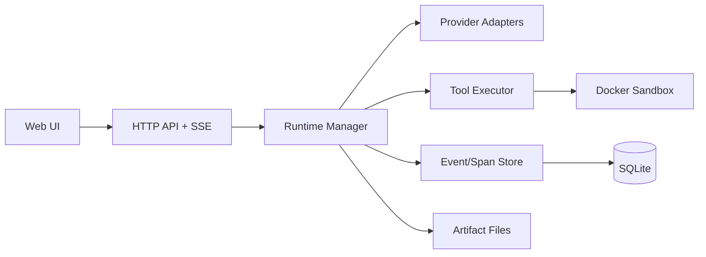

# Architecture

`colosseum` follows a single-node control-plane architecture with explicit contracts between orchestration, session state, tool execution, providers, and UI.

## System Overview

## Core Components

## 1. API Layer (`internal/api`)

- REST endpoints for agents, runs, tools, workflows, policies, secrets, provider configs
- SSE event stream per run (`/api/stream/runs/:id`)
- Run telemetry endpoints for timeline/debug UI
- Embedded static UI asset serving

## 2. Runtime Manager (`internal/runtime`)

- Polls queued runs and claims execution
- Executes model → tool → observe loops
- Persists steps, tool calls, spans, and events
- Handles retries, status transitions, interruption, resume
- Graceful cancellation support on server shutdown

Session-oriented methods:

- `Wake(sessionId)`
- `Interrupt(sessionId)`
- `Resume(sessionId)`

## 3. Session/Trace Persistence (`internal/db`)

SQLite stores metadata and timeline data:

- `runs`, `run_steps`, `tool_calls`
- `events`, `trace_spans`
- `approvals`, `policies`
- `artifacts`, `containers`
- `tool_defs`, `workflow_defs`, `provider_configs`, `secrets`

Artifacts/logs are stored on local disk and linked in DB.

## 4. Tool Layer (`internal/tools`)

Built-ins:

- `shell.exec`
- `file.read`
- `file.write`
- `file.search`
- `patch.apply`
- `test.run`
- `artifact.list`
- `artifact.get`

Custom tool support:

- DB-backed `tool_defs`
- runtime-resolved execution
- initial custom kind: `shell_command`

## 5. Docker Sandbox (`internal/docker`)

- Per-run container lifecycle and command exec
- Workspace mount at `/workspace`
- Cleanup routines for run and orphaned containers

## 6. Provider Adapters (`internal/providers`)

- Anthropic Messages API
- OpenAI Chat Completions API
- Tool-calling normalization and argument handling
- Usage accounting extraction

## Execution Lifecycle

1. User submits run.
2. Run is persisted as `queued`.
3. Runtime claims run and sets `running`.
4. Model produces text and/or tool calls.
5. Tools execute in workspace context.
6. Steps/events/spans/artifacts are persisted.
7. Run terminates as `completed`, `failed`, `interrupted`, or `cancelled`.

## Design Constraints

- Single-node, internal-ops focused
- Deterministic recording and replayability
- Strong observability and operator control
- Incremental extensibility (tools, providers, workflows)

