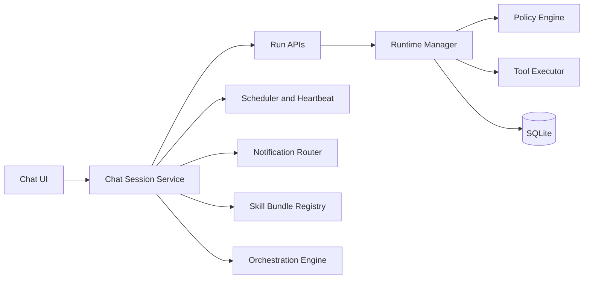

# RFC: Chat-First Assistant Roadmap

- **Status**: Proposed
- **Owner**: Colosseum Core Team
- **Last Updated**: 2026-04-15
- **Target Start**: 2026-Q2

## 1) Summary

Colosseum now has a first-party chat UI. This RFC defines a phased roadmap to evolve chat from a run-launch interface into a durable assistant surface while preserving Colosseum's strengths in replayability, telemetry, policy control, and evaluations.

The plan introduces a first-class session model, proactive automations, reusable skill bundles, and multi-agent orchestration in controlled phases with clear rollback points.

## 2) Motivation

Today, Colosseum is strongest at deterministic execution and post-hoc debugging. Chat exists, but each turn is represented as a new replay-linked run, which is excellent for traceability and weaker for day-to-day assistant ergonomics.

We want to add assistant-native UX (persistent sessions, proactive updates, quick actions, templates) without regressing:

- run-level provenance
- approval and policy boundaries
- auditability
- operator control

## 3) Goals and Non-Goals

### Goals

- Make chat a daily operator interface, not only a run launcher.
- Preserve one-click drill-down from chat into run telemetry.
- Add proactive automation with explicit guardrails.
- Make common workflows reusable and shareable.
- Enable scalable delegation across specialist agents.

### Non-Goals

- Replace run-level data model with opaque conversation-only logs.
- Add broad public internet exposure or multi-tenant SaaS controls in this RFC.
- Introduce irreversible breaking API changes without compatibility layers.

## 4) Current State

Current capabilities provide a strong base:

- First-party `/chat` page with session-like grouping from replay lineage.
- Run lifecycle controls (`cancel`, `interrupt`, `resume`, `approve`).
- Streaming updates via SSE per run.
- Run telemetry, tool calls, events, artifacts, and replay controls.
- Policies, environments, credential vaults, and eval suite/runs surfaces.

Current gaps relative to assistant-first systems:

- no first-class `chat_session` resource
- no scheduler/heartbeat for proactive tasks
- no skill/template packaging model
- no explicit coordinator/worker orchestration primitive
- no channel/push notifications

## 5) Design Principles

- **Traceability first**: every assistant action maps to one or more runs.
- **Operator over autonomy**: approvals and policy checks remain authoritative.
- **Progressive enhancement**: each phase stands on its own and can ship independently.
- **Backward compatibility**: existing run and replay APIs continue to work.
- **Small blast radius**: feature flags and phased rollouts for all major additions.

## 6) Proposed Architecture

### Key additions

- `chat_sessions` and `chat_messages` as first-class resources
- scheduler for time-based jobs and heartbeat checks
- skill bundle registry backed by versioned manifests
- orchestration planner for coordinator -> worker fan-out
- notification router for digest and action links

## 7) Data Model Changes

All schema names are provisional and can be refined during implementation.

### New tables (proposed)

- `chat_sessions`
  - `id`, `title`, `agent_id`, `status`, `created_at`, `updated_at`, `archived_at`
- `chat_messages`
  - `id`, `session_id`, `role`, `content`, `source`, `created_at`
  - `run_id` nullable link for assistant/system events backed by run execution
- `session_runs`
  - `session_id`, `run_id`, `turn_index`
- `scheduled_jobs`
  - `id`, `name`, `session_id` nullable, `agent_id`, `cron_expr`, `enabled`, `delivery_mode`, `created_at`, `updated_at`
- `scheduled_job_runs`
  - `id`, `job_id`, `run_id`, `status`, `started_at`, `completed_at`
- `skills`
  - `id`, `name`, `version`, `manifest_json`, `created_at`, `updated_at`
- `orchestration_runs`
  - `id`, `parent_run_id`, `plan_json`, `status`, `created_at`, `updated_at`
- `orchestration_tasks`
  - `id`, `orchestration_run_id`, `worker_agent_id`, `run_id`, `status`, `priority`, `created_at`, `updated_at`

### Compatibility notes

- Existing `runs.replay_source_run_id` remains unchanged.
- New chat session APIs should be derivable from existing run lineage for old data.
- Migration should backfill `chat_sessions` for existing replay chains where possible.

## 8) API Plan

### Phase 1 APIs (Session-native chat)

- `GET /api/chat/sessions`
- `POST /api/chat/sessions`
- `GET /api/chat/sessions/{id}`
- `PATCH /api/chat/sessions/{id}` (rename, archive, pin metadata)
- `POST /api/chat/sessions/{id}/messages` (user send)
- `GET /api/chat/sessions/{id}/messages`
- `POST /api/chat/sessions/{id}/attachments`

Behavior:

- Sending a user message creates a new run and links it to `session_runs`.
- The response stream continues to use existing run event SSE and/or a session stream facade.

### Phase 2 APIs (Proactive automation)

- `GET /api/chat/jobs`
- `POST /api/chat/jobs`
- `PATCH /api/chat/jobs/{id}`
- `POST /api/chat/jobs/{id}/run-now`
- `GET /api/chat/jobs/{id}/history`
- `POST /api/chat/notifications/test`

### Phase 3 APIs (Skills)

- `GET /api/skills`
- `POST /api/skills`
- `GET /api/skills/{id}`
- `POST /api/skills/import`
- `GET /api/skills/{id}/export`
- `POST /api/chat/sessions/{id}/apply-skill`

### Phase 4 APIs (Orchestration)

- `POST /api/orchestrations`
- `GET /api/orchestrations/{id}`
- `POST /api/orchestrations/{id}/cancel`
- `GET /api/orchestrations/{id}/tasks`

## 9) UI Plan

### Phase 1

- chat session list with rename/archive/pin
- richer composer: attachments, slash commands, starter prompt chips
- inline action chips on system events (`approve`, `resume`, `open run`)
- session search and filters (agent/status/date)

### Phase 2

- jobs/heartbeat management UI
- digest previews and delivery settings
- "Run now" and history views

### Phase 3

- skill library page (built-in + custom)
- apply skill flow in chat
- skill version history and rollback

### Phase 4

- orchestration timeline (coordinator + worker lanes)
- consolidated result board
- per-worker policy and secret scope visualization

## 10) Implementation Phases

## Phase 1: Session-Native Chat

**Duration**: 2-4 weeks
**Outcome**: Chat sessions are first-class without losing run granularity.

Deliverables:

- DB migrations for sessions/messages/session-runs
- session API endpoints
- chat UI migration from replay-derived sessions to explicit sessions
- attachments in composer via existing run file-upload mechanics
- slash commands for top operator actions

Acceptance criteria:

- operators can create, rename, archive, and revisit sessions
- each message produces traceable linked run(s)
- no regression in run detail observability

## Phase 2: Proactive Jobs and Heartbeats

**Duration**: 4-8 weeks
**Outcome**: Colosseum can proactively monitor and report.

Deliverables:

- scheduler service and job execution loop
- job CRUD and history APIs
- notification routing abstraction (start with in-app + email/webhook)
- built-in templates: daily briefing, CI triage, regression digest

Acceptance criteria:

- jobs execute reliably with bounded retries
- users can disable noisy jobs quickly
- digests link directly to actionable runs

## Phase 3: Skill Bundles and Templates

**Duration**: 6-10 weeks
**Outcome**: Reusable packaged workflows.

Deliverables:

- skill manifest schema and validation
- import/export flow and versioning
- template gallery and apply flow
- policy compatibility checks before apply

Acceptance criteria:

- skill apply creates predictable session/run setup
- rollbacks preserve prior working versions
- invalid manifests fail with clear errors

## Phase 4: Multi-Agent Orchestration

**Duration**: 8-12 weeks
**Outcome**: Coordinator can delegate to specialists safely.

Deliverables:

- orchestration planner/executor
- worker run linking and consolidated result model
- policy-aware delegation gates per worker
- orchestration UI timeline and summary board

Acceptance criteria:

- coordinator/worker trace is fully auditable
- failures isolate to worker tasks where possible
- operator can approve/cancel at orchestration and worker levels

## Phase 5: Hardening and Enterprise Controls

**Duration**: ongoing

Deliverables:

- fine-grained session ACLs and audit exports
- advanced approval policy language enhancements
- reliability SLO dashboards and alerting
- disaster recovery playbooks for scheduler/orchestration services

## 11) Rollout Strategy

- feature flags per phase (`chat_sessions_v1`, `chat_jobs_v1`, `skills_v1`, `orchestrations_v1`)
- internal dogfood environment before default enablement
- staged enablement:
  1. local/dev
  2. selected operators
  3. default-on
- migration tooling with dry-run mode and rollback instructions

## 12) Testing Strategy

### Unit

- session lifecycle, message linkage, scheduler timing and retries
- skill manifest validation
- orchestration planning and state transitions

### Integration

- end-to-end: chat send -> run -> streamed events -> linked session timeline
- job execution with policy interruptions and approvals
- skill apply and rollback
- orchestration fan-out and merge

### Non-functional

- load tests for high message and job volume
- chaos tests for runtime restarts mid-orchestration
- migration and backfill correctness tests

## 13) Metrics and Success Criteria

- time-to-first-useful-result (TTFUR) in chat
- runs per active session
- session revisit rate
- approval turnaround time
- automated job success rate
- orchestration completion rate
- regression detection-to-resolution latency

Phase gates should require measurable improvement in at least two primary metrics without regressing policy safety metrics.

## 14) Risks and Mitigations

- **Risk: Data model complexity growth**
  - Mitigation: keep run model as source of execution truth; chat/orchestration are linkage layers.
- **Risk: Noisy proactive notifications**
  - Mitigation: default conservative schedules, easy mute/disable controls, digest consolidation.
- **Risk: Policy bypass through orchestration**
  - Mitigation: enforce policy checks at every worker tool call, not only coordinator level.
- **Risk: Migration issues for existing chats**
  - Mitigation: backfill with idempotent jobs + rollback scripts + visibility reports.
- **Risk: UX overload**
  - Mitigation: progressive disclosure in UI and phase-gated feature entry points.

## 15) Open Questions

- Should session streaming be a separate SSE endpoint or composed from run SSE fan-in?
- Do we need message-level redaction before introducing external notification channels?
- Should skills be globally scoped first, or user/team scoped from day one?
- Which orchestration strategy is safest initially: static worker graph or dynamic planner output?

## 16) Initial Execution Plan (first 6 weeks)

### Sprint 1-2

- finalize session schema and migration
- implement session/message APIs
- update chat UI to explicit sessions
- ship rename/archive/search

### Sprint 3-4

- add attachments in chat composer
- add action chips for run controls in timeline
- introduce slash commands for core actions
- add metrics instrumentation for phase-1 KPIs

### Sprint 5-6

- scheduler MVP with one built-in template (daily run digest)
- in-app digest delivery and job history
- operator tuning controls (enable/disable, quiet hours)

## 17) Decision Log (to fill during implementation)

- _TBD: session stream approach selected_
- _TBD: scheduler engine library and persistence approach selected_
- _TBD: skill manifest version `v1` fields locked_
- _TBD: orchestration execution strategy selected_

